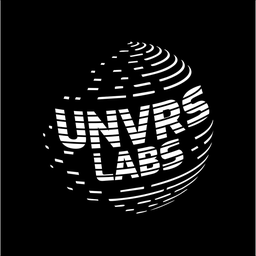

# UNVRS Capture

<p align="center">
  
</p>

<p align="center">
  
  
  
</p>

### Open-source screen recorder by UNVRS Labs.

UNVRS Capture is a free, creator-focused desktop app for polished screen recordings — auto-zooms, cursor polish, webcam overlays, styled backgrounds, timeline editing, and one-click export to MP4 or GIF.

Built and maintained by [UNVRS Labs](https://unvrslabs.dev).

---

## Attribution

UNVRS Capture is an independent fork of [**Recordly**](https://github.com/webadderall/Recordly) by `webadderall`, released under the GNU Affero General Public License v3.0. Recordly itself was originally derived from the OpenScreen project by Siddharth Vaddem (2025).

We are deeply grateful to the upstream maintainers and contributors. All source code modifications made by UNVRS Labs are published in this repository under AGPLv3, as required by the license.

- Upstream project: https://github.com/webadderall/Recordly
- Original license: AGPLv3 (see [LICENSE.md](LICENSE.md))
- This fork: https://github.com/unvrslabs/unvrs-capture

The names "Recordly" and the original Recordly branding are property of their respective authors and are **not** used in this fork.

---

## Download

Prebuilt binaries for macOS, Windows and Linux are published on our [GitHub Releases page](https://github.com/unvrslabs/unvrs-capture/releases) and linked from [unvrslabs.dev](https://unvrslabs.dev).

| Platform | File |
|----------|------|
| macOS (Apple Silicon) | `UNVRSCapture-arm64.dmg` |
| macOS (Intel) | `UNVRSCapture-x64.dmg` |
| Windows x64 | `UNVRSCapture-windows-x64.exe` |
| Linux x64 | `UNVRSCapture-linux-x64.AppImage` |

System requirements:

- **macOS** 14.0+
- **Windows** 10 Build 19041+
- **Linux** on modern distros (cursor hiding not supported on Linux)

---

## Features

- Auto-zoom suggestions based on cursor activity
- Cursor polish — smoothing, motion blur, click bounce, sway
- Webcam bubble overlay with positioning, mirror, shadow, zoom-reactive scaling
- Timeline editor — trim, speed regions, annotations, extra audio tracks
- Styled frames — wallpapers, gradients, blur, padding, shadows, rounded corners
- Aspect ratio presets and custom output dimensions
- Export to MP4 (with quality selector) and GIF (with FPS, loop, size presets)
- Customizable keyboard shortcuts
- Project files (`.recordly`) — save and resume editing sessions

---

## Build from source

### Prerequisites

**macOS:** Xcode Command Line Tools (`xcode-select --install`).

**Linux (Ubuntu/Debian):**

```bash
sudo apt install build-essential cmake libx11-dev libxtst-dev libxrandr-dev libxt-dev
```

**Windows:** Visual Studio Build Tools 2022 with C++ workload.

### Build

```bash
npm install
npm run build:mac     # or build:win / build:linux
```

Artifacts are emitted under `release/`.

---

## License

AGPL 3.0 — see [LICENSE.md](LICENSE.md) for the full text and a plain-language summary.

In short: you can use, modify and self-host this software freely, but if you distribute modifications or operate it as a service, you must publish your full source under the same AGPLv3 license.

The "Recordly" name and branding cannot be reused. The "UNVRS Labs" and "UNVRS Capture" names and logos are trademarks of UNVRS Labs.

---

## Contributing

Contributions are welcome — open an issue or a pull request. For code style, see [CONTRIBUTING.md](CONTRIBUTING.md). Where appropriate, useful improvements will be proposed back to the upstream Recordly project.
